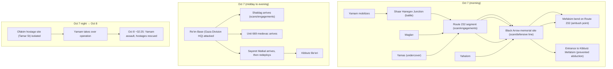

# Merged Location-Deployment Ranking of Israeli Units During Oct 7–9, 2023 (Open-Source)

## Executive summary

This manuscript ranks selected Israeli units by the number of distinct, named deployment locations documented during Oct 7–9, 2023 (local time; first 48 hours after the attack began). "Distinct locations" include (a) towns/kibbutzim, (b) military bases/crossings, and (c) junction/route nodes and other discrete tactical points when explicitly named.

The evidence base prioritizes: (1) official IDF publications; (2) probe-based reporting tied to IDF investigations; (3) major Israeli outlets (Hebrew where possible); (4) international wire/service reporting.

## Time window and scope

- Window: 2023-10-07 00:00 (Asia/Jerusalem) through 2023-10-09 23:59 (Asia/Jerusalem).
- Geography: Israel's Gaza-envelope / western Negev, including relevant bases and junctions immediately outside the envelope when explicitly linked to Oct 7–9 movements.

## Methods

### Canonicalization
- Kibbutz/town names normalized (e.g., "Be'eri" → "Kibbutz Be'eri").
- "Re'im Base (Gaza Division HQ)" distinguished from "Kibbutz Re'im."
- Junctions and road segments standardized (e.g., "Shaar Hanegev Junction," "Route 232 segment," "Mefalsim bend").

### Confidence labels
- VERIFIED: official IDF publication or probe-based ToI reconstruction tied to an IDF probe.
- LIKELY: major outlet, not clearly tied to a probe OR single-source.
- UNCONFIRMED: attachment-only or missing retrievable URLs / missing location specificity.

### Resolution rules
If sources conflict:
1. Prefer official IDF publications and published inquiry materials.
2. Prefer Hebrew-language primary/official sources over secondary.
3. Prefer probe-based reconstructions citing an IDF probe.
4. Require at least one high-quality source naming BOTH unit and location.

## Results: ranking by verified distinct-location count

Top units by VERIFIED location count (ties not broken):

| Unit | Verified distinct locations (Oct 7–9) | Notes on evidence basis |
|---|---:|---|
| Yamam | 7 | Multiple discrete nodes documented in probe-based reconstructions (junction/road/memorial/kibbutz entrances + Ofakim hostage site). |
| Shayetet 13 | 6 | Official IDF publication explicitly enumerates key focal points (kibbutzim/outpost). |
| Multidomain Unit 888 | 6 | Official IDF publication explicitly enumerates six Gaza-envelope locations. |
| 99th Division | 5 | Official IDF narrative documents movement across multiple towns/kibbutzim and a festival-area node. |
| Sayeret Matkal | 4 | Probe-based accounts document distinct deployments (base + multiple kibbutzim). |
| Maglan | 4 | Probe-based accounts document road/memorial/bend plus entry into a kibbutz battle. |
| Yahalom | 4 | Probe-based accounts document memorial site + kibbutz battle + Erez base & subsequent movement node. |
| Shaldag | 2 | Probe-based accounts document Re'im Base fighting and engagement at Alumim. |
| ISA/Shin Bet operational elements | 2 | Probe-based account documents operatives with Yamam at junction and kibbutz entrance. |
| Yamas | 2 | Probe-based account documents road scan + memorial-site area. |
| Unit 669 | 2 | Probe-based accounts document medevac presence at Re'im Base and additional base-area operations. |
| Duvdevan | 1 | Probe-based account documents entry into Kfar Aza battle. |

(See data/evidence_matrix.csv for full unit×location evidence, URLs, and confidence.)

## Unit profiles (canonical locations)

### Yamam (Israel Police)
Verified locations:
- Shaar Hanegev Junction
- Route 232 segment (between junction and Black Arrow area)
- Black Arrow memorial site
- Mefalsim bend (Route 232)
- Entrance to Kibbutz Mefalsim
- Kibbutz Re'im (main entrance)
- Ofakim (Tamar Street hostage-site operation)

### Shayetet 13 (IDF Navy)
Verified locations:
- Kibbutz Be'eri
- Sufa outpost (Motsav Sufa)
- Kibbutz Kfar Aza
- Kibbutz Sa'ad
- Kibbutz Mefalsim
- Kibbutz Nir Oz

### Multidomain Unit 888 (IDF)
Verified locations:
- Kibbutz Erez
- Kibbutz Urim
- Kibbutz Re'im
- Kibbutz Be'eri
- Kibbutz Alumim
- Kibbutz Nahal Oz

### 99th Division (IDF)
Verified locations:
- Netivot
- Kibbutz Alumim
- Kibbutz Be'eri
- Kibbutz Re'im
- Re'im parking lot / Nova festival area (Haniyon Re'im)

### Sayeret Matkal (IDF)
Verified locations:
- Kibbutz Kfar Aza
- Re'im Base (Gaza Division HQ)
- Kibbutz Re'im
- Kibbutz Be'eri

### Maglan (IDF)
Verified locations:
- Route 232 segment (scan/engagements)
- Black Arrow memorial site
- Mefalsim bend (Route 232)
- Kibbutz Kfar Aza

### Yahalom (IDF Combat Engineering)
Verified locations:
- Black Arrow memorial site
- Kibbutz Alumim
- Erez Crossing adjacent base
- Yad Mordechai Junction

### Shaldag (IAF)
Verified locations:
- Re'im Base (Gaza Division HQ)
- Kibbutz Alumim

### ISA/Shin Bet operational elements
Verified locations:
- Shaar Hanegev Junction
- Entrance to Kibbutz Mefalsim

### Yamas (Border Police undercover)
Verified locations:
- Route 232 segment (scanning/engagements)
- Black Arrow memorial site

### Unit 669 (IAF CSAR)
Verified locations:
- Re'im Base (Gaza Division HQ)
- Mopdarom base (medevac presence under fire)

### Duvdevan (IDF)
Verified locations:
- Kibbutz Kfar Aza

## Movement timeline (mermaid flowchart)

## Discrepancy notes (attachment vs merged)

- Several attachment rows lacked URLs and/or explicit locations; these were retained as UNCONFIRMED leads and not allowed to change verified counts without corroboration.
- Where probe-based/official sources explicitly named unit+location, those records were promoted to VERIFIED.

| Item type | Unit | Attachment claim | Status in merged dataset | Resolution rationale |
|---|---|---|---|---|
| Missing URL + specific locations asserted | Yahalom | Locations listed but URL missing in-row | Only locations corroborated by probe-based sources upgraded to verified | Prefer probe-based IDs/ToI/IDF; retain attachment-only locations as unconfirmed. |
| Unit referenced but no location | Shaldag | Unit referenced; no location field | Re'im Base + Alumim verified via probe-based ToI | Attachment used as lead; location assignment requires explicit location statement. |
| Unit referenced but no location | Unit 669 | Unit referenced; no location field | Re'im Base + Mopdarom Base verified via probe-based ToI | Upgrade only when ToI probe ties unit to base event. |
| Unclear / domain-mismatch (out-of-scope) | Various | Some rows are strategic/analytical pieces without unit–location deployment facts | Excluded from evidence matrix | Inclusion requires unit + location + deployment relevance to Oct 7–9 window. |
| New unit not in baseline + no corroborating URL | "General Staff Negotiations Unit" | "Urim" asserted; URL absent | Not verified; retained as unconfirmed lead | No corroborating official/probe source retrieved; kept for follow-up. |

## Data gaps, uncertainties, and recommended next steps

Open sources still under-specify complete unit movement itineraries across Oct 7–9, especially for intelligence services and police components whose tactical movements may remain classified or described only in partial media narratives.

Key steps to materially improve accuracy:
- Systematically ingest all released battle probes (when published) and map them to unit participation fields, distinguishing "unit present" from "individual member present."
- Expand Hebrew-first collection for police/ISA operational summaries and cross-validate against probe-based reconstructions and official statements.
- If feasible, obtain declassified/authorized extracts from after-action reports that explicitly list unit movements (ideally with time stamps and a standardized gazetteer).

## References

See references/references.bib for BibTeX entries and full URLs for prioritized sources.
